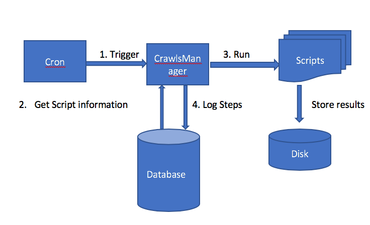

# Jail Crawl Architecture

### Requirements for every submitted crawler

* Accept parameters
  1. Output folder
  2. Wait between pages in millisecond (can be 0)  
* Do not swallow any errors
  
* In the UI, we will provide a 'submit script' button.
* We will also ask for a spreadsheet with all expected environmental settings on OS and example to execute your crawlers (may be empty).

Example:

        For python I require pandas, install like ….
        Website crawled by Filename.py, http://alabamaroaster.com.
        Run like py Filename.py --/opt/result/2018-08-06/

### Implementation Details

Below are known formats for programs/scripts/jobs for crawling.

* Java
* Python
* R

In the future we will introduce more languages.

Functionality

* Scripts will be organize by jailcrawl framework.
* This framework will create a new folder for every crawl, where individual scripts will save their results.
* The results will be compressed and stored in a cloud storage.
* Soon we will have monitoring of the process, with alarms.

CrawlManager will provide above mentioned infra, with below design.

* Logger for logging self-activities
* Read script definition and location from DB.
* Trigger Scripts in batches, as sequence will not complete and all in parallel will hamper performance.
* With every action, update DB for every script so that there is no need to look into log file.

Above mentioned CrawlsManager will be triggered by cron or some other scheduler.

Release plan in phases

* Run all existing scripts by Crawls manager in batches and update DB
* Provide a UI to see success/Failure of any script
* Integrate with smtp to write to admins about exception as soon as it is raised.

We should have shell scripts to do the below

* Setup all required components like python, java, R, Mysql DB through script
* Setup tor and privoxy through script
* Download all script from Github and prepare to run
* Modify crontab to kickoff scripts (or one schedule to kick off the java crawl manager)
* Create and Insert SQL or NoSQL script for DB.
